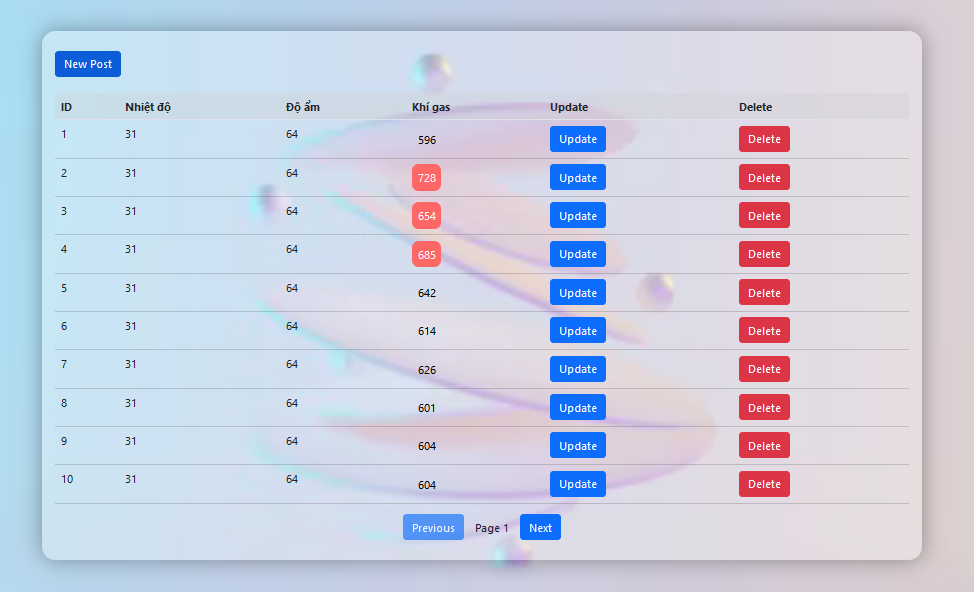

GAS_SYS_TEMP_PROJECT
</br>
BE
--------------------------
```
$ npm i
$ npx nodemon sensorGasTemp.js
or
$ npm start (bellow configure)
```
``npm start`` to configure the **commands**, go to the file ``package.json``, look at the ``"scripts"`` section and add ``"start": "nodemon sensor.js"``.
</br>
FE
--------------------------
```
$ npm i axios
$ npm install styled-components
$ npm start
```


</br>
BD
--------------------------
SETUP DB with the **commands**
**Commands** use:
```
create schema your_db
$ SELECT * FROM cntt2.sensorgas_temp;
$ ALTER USER 'root'@'localhost' IDENTIFIED WITH mysql_native_password BY your_pass;
$ truncate sensorgas_temp;
```

